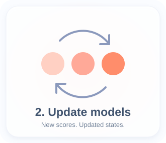
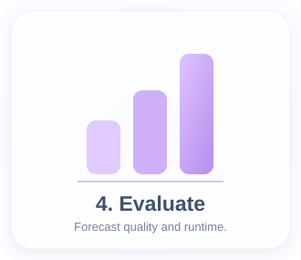

<p align="center">
  
</p>

<p align="center">
  <strong>Sequential Bayesian forecasting of eczema severity</strong>
</p>

<p align="center">
  <a href="#explore-the-workflow"><strong>Workflow</strong></a>
  &nbsp;·&nbsp;
  <a href="#run-the-research-pipeline"><strong>Reproduce the analysis</strong></a>
  &nbsp;·&nbsp;
  <a href="#outputs-and-reproducibility"><strong>Outputs</strong></a>
</p>

XemaPred is a sequential Bayesian forecasting framework for longitudinal eczema severity. As new patient observations arrive, it updates the current disease state and produces probabilistic forecasts of patient-oriented SCORAD (PO-SCORAD). The repository contains the population-level and patient-specific inference workflows, the original EczemaPred comparison, processing and plotting code.

## Explore the workflow

<p align="center">
  <a href="#1-record-scores"></a>
  &nbsp;
  <a href="#2-update-models"></a>
  &nbsp;
  <a href="#3-forecast"></a>
  &nbsp;
  <a href="#4-evaluate"></a>
</p>

<p align="center">
  <sub>Click a card to jump directly to that stage of the workflow.</sub>
</p>

</details>

## 1. Record scores

A forecast starts with an observation: how much skin is affected, the intensity of six signs, and the patient’s itching and sleep scores. Together, these nine items describe the components of PO-SCORAD. Repeated observations give the models a history to learn from.

| Component | Configuration values for `score` | Item model |
| --- | --- | --- |
| Extent | `extent` | `BinMC` |
| Intensity signs | `dryness`, `redness`, `swelling`, `oozing`, `thickening`, `scratching` | `OrderedRW` |
| Subjective symptoms | `itching`, `sleep` | `BinRW` |

## 2. Update models

When a new score arrives, the sequential models update their current representation of severity. Patient-specific particle filters maintain a collection of possible states for each item, adjust their weights using the observation, and resample or rejuvenate particles when needed. Population-level XemaPred uses SMC² to learn across patients.

Population information can also inform a patient-specific model’s prior. The project explores transfer from another cohort and priors learned from held-out patient folds, keeping the source and evaluation patients separate.

| Approach | Role in the project | Implementation |
| --- | --- | --- |
| EczemaPred | Original Stan/MCMC model fits used for comparison | [EczemaPred](scripts/01_run_models/EczemaPred) |
| Population-level XemaPred | SMC² inference with parameter particles and inner state filters | [XemaPred](scripts/01_run_models/XemaPred) |
| Patient-specific XemaPred | Per-patient particle states, with base or population-informed priors | [PatientSpecificXemaPred](scripts/01_run_models/PatientSpecificXemaPred) |
| Reference models | Uniform, historical, Markov-chain, random-walk, AR1, mixed AR1 and smoothing baselines; available targets vary by model | [reference_models](scripts/01_run_models/reference_models) |

This cna be run in a phoen and updates the nine item states sequentially, then combines their forecasts.

**Explore:** [Model-running commands](#2-run-a-model)

## 3. Forecast

The updated models generate possible future values for each item. These predictive draws are combined into total PO-SCORAD, producing a predicted course and an uncertainty interval rather than a single future value alone.

The models predicts the next **four days** PO-SCORAD severity with ucnertaintcy bands. Research configurations cover both **one-day and four-day horizons**.

**Explore:** [Forecast plotting](scripts/03_plotting/patient_trajectories/plot_patient_forecasted_trajectories.R) · [Saved predictions and states](#outputs-and-reproducibility)

## 4. Evaluate

The research pipeline asks two questions: **how well do the forecasts predict future observations, and how much computation do they require?** Forward-chaining validation trains on the observations available up to each time point and evaluates predictions against subsequent observations.

Processing scripts calculate log predictive density (LPD), continuous ranked probability score (CRPS), and several accuracy summaries at item and total-score level. Runtime and scalability analyses compare the cost of the original EczemaPred models, population XemaPred, patient-specific XemaPred, and reference methods.

The outputs become learning curves, patient trajectories, runtime comparisons and diagnostic figures. These comparisons depend on completing the relevant model runs and processing their predictions first.

**Explore:** [Process results](#3-process-predictions-and-diagnostics) · [Generate figures](#4-generate-figures) · [Runtime analysis](scripts/03_plotting/runtime/plot_runtime.R)

## Run the research pipeline

To reproduce the workflow above, **configure → fit/validate → process → plot**. Before running R commands, complete the [environment setup](#set-up-the-r-environment) and check [data access](#requirements-and-data-access). Model runs can be computationally intensive; the examples below are research jobs, not quick installation tests.

### 1. Choose a configuration

Configuration files live under [configs/](configs), organised by dataset, approach and horizon. Each item runner takes one YAML file as its positional argument.

For example, [PFDC patient-specific dryness, H4](configs/PFDC/PatientSpecificXemaPred/t_horizon_4/pfdc_dryness_orderedrw.yaml) specifies:

```yaml
dataset: "PFDC"
score: "dryness"
model: "OrderedRW"
t_horizon: 4
n_particles: 4000
ess_frac: 0.5
n_cluster: 4
run: true
pmmh_window_n: 20
```

| Setting | Meaning |
| --- | --- |
| `dataset`, `score`, `model` | Data source, target item and compatible model family |
| `t_horizon` | Forecast/validation horizon; supplied experiments use 1 or 4 |
| `n_cluster` | Parallel workers; adjust to the resources actually allocated |
| `n_particles`, `ess_frac` | Patient-specific particle count and resampling threshold |
| `n_theta`, `n_x` | Population SMC² parameter-particle and inner-state-particle counts |
| `ess_theta`, `ess_x` | Population SMC² resampling thresholds |
| `n_chains`, `n_iter` | Stan settings for EczemaPred and applicable reference models |
| `pmmh_window_n` | Observation window used during particle marginal Metropolis–Hastings rejuvenation |
| `seed` | Optional random seed recorded with run metadata |
| `run` | Set to `false` to prepare/check a run without fitting |
| `run_suffix` | Separate output/cache identity for population and patient-specific XemaPred variants |

Only use settings supported by the chosen runner. For a first configuration check, copy a supplied YAML, set `run: false`, and use `n_cluster: 1`. This still loads dependencies and data, creates output directories and writes metadata; population-informed runs also need their prior files. Use a new `run_suffix` for XemaPred checks to avoid overwriting metadata from an existing experiment.

### 2. Run a model

Choose the command matching the experiment. These examples all use PFDC and a four-day horizon.

```bash
# Original EczemaPred: dryness.
Rscript scripts/01_run_models/EczemaPred/run_validation.R \
  configs/PFDC/EczemaPred/t_horizon_4/pfdc_dryness_orderedrw.yaml

# Population-level XemaPred: dryness.
Rscript scripts/01_run_models/XemaPred/run_validation.R \
  configs/PFDC/XemaPred/t_horizon_4/pfdc_dryness_orderedrw.yaml

# Patient-specific XemaPred with the base prior: dryness.
Rscript scripts/01_run_models/PatientSpecificXemaPred/run_validation.R \
  configs/PFDC/PatientSpecificXemaPred/t_horizon_4/pfdc_dryness_orderedrw.yaml

# Reference model: historical dryness predictions.
Rscript scripts/01_run_models/reference_models/run_validation.R \
  configs/PFDC/reference_models/historical/t_horizon_4/pfdc_dryness_historical.yaml
```

One command fits **one target**, not the complete experiment. Run the required item configurations for each cohort and horizon before generating aggregate comparisons. Total PO-SCORAD processing needs the complete set of item predictions for the item-based models. Runtime analyses commonly use H1 outputs, while forecast-performance processing defaults to H4.

### 3. Process predictions and diagnostics

After the corresponding model outputs exist:

```bash
Rscript scripts/02_process_results/process_eczemapred.R
Rscript scripts/02_process_results/process_XemaPred.R
Rscript scripts/02_process_results/process_patients_specific_XemaPred.R
Rscript scripts/02_process_results/process_reference_models.R
```

These processors default to multiple datasets and metrics; the commands above are intended for a populated experiment directory. They generally overwrite processed summaries by default. Use `--help` to inspect each script's options and `--overwrite 0` to retain existing summaries.

For a narrower population-level processing pass, once all PFDC H4 item predictions are available:

```bash
Rscript scripts/02_process_results/process_XemaPred.R \
  --datasets PFDC \
  --metrics lpd,CRPS \
  --perf_horizon 4 \
  --record_timing 0 \
  --strict_files 1 \
  --overwrite 0
```

Here, `--record_timing 0` avoids requiring the separate H1 runtime outputs. `--strict_files 1` makes missing inputs explicit. Setting `--poscorad 0` skips total-score evaluation, but does not turn a processor's full item grid into a single-item run.

### 4. Generate figures

Plotting scripts read predictions or processed summaries and write to `plots/`. Review each script's configuration block for the datasets, model variants and horizons it expects.

| Figure family | Entry point |
| --- | --- |
| Score distributions | [plot_score_distributions.R](scripts/03_plotting/dataset_description/plot_score_distributions.R) |
| Observed patient trajectories | [plot_patient_observed_trajectories.R](scripts/03_plotting/patient_trajectories/plot_patient_observed_trajectories.R) |
| Forecast patient trajectories | [plot_patient_forecasted_trajectories.R](scripts/03_plotting/patient_trajectories/plot_patient_forecasted_trajectories.R) |
| Forecast-performance learning curves | [forecasting_performance_learning_curves.R](scripts/03_plotting/learning_curves/forecasting_performance_learning_curves.R) |
| Runtime comparisons | [plot_runtime.R](scripts/03_plotting/runtime/plot_runtime.R) |
| Scaling analyses | [plot_scalability.R](scripts/03_plotting/scalability/plot_scalability.R) |
| SMC diagnostics | [smc_diagnostics_report.R](scripts/03_plotting/smc_diagnosis/smc_diagnostics_report.R) |

For example:

```bash
Rscript scripts/03_plotting/learning_curves/forecasting_performance_learning_curves.R
Rscript scripts/03_plotting/runtime/plot_runtime.R
Rscript scripts/03_plotting/scalability/plot_scalability.R
```

The current learning-curve configuration uses the canonical patient-specific comparison: **PFDC CrossCohort** and **Derexyl PopPrior**, alongside EczemaPred, population XemaPred and reference models. Base patient-specific fits alone will not reproduce that comparison. Figure availability depends on the input runs and summaries; running a plotting script does not generate missing fits.

## Outputs and reproducibility

The standard model output layout is:

```text
results/
└── <dataset>/
    ├── <score>/
    │   └── <model-variant>/
    │       └── H<horizon>/
    │           ├── cfg.yaml       # Configuration used for the run
    │           ├── meta.json      # Run settings and seed metadata
    │           ├── fits/          # Fitted objects / cached particle states
    │           ├── iters/         # Iteration outputs, when enabled
    │           ├── diag/          # Diagnostics, when enabled
    │           ├── posterior/     # Population posterior snapshots, where applicable
    │           └── final/         # Combined predictions and diagnostics
    └── ALL_MODELS/
        ├── ITEMS/<metric>/        # Processed item-level performance
        ├── POSCORAD/<metric>/     # Processed total-score performance
        └── comp_time/            # Processed runtime summaries
```

For example, population dryness forecasts use `OrderedRW-XemaPred`, base patient-specific forecasts use `OrderedRW-PatientSpecificXemaPred`, and original EczemaPred uses `OrderedRW`. XemaPred variants append their configured run suffix.

Population XemaPred caches its state at `fits/smc2/pf_state.rds`; patient-specific XemaPred uses `fits/patient_<id>/pf_state.rds`. The runners support resuming from existing outputs. Keep compatible caches to continue an interrupted run; use a distinct output identity when changing XemaPred model settings or priors. Reusing a directory with changed settings can mix incompatible artifacts.

## Repository guide

```text
XemaPred/
├── README.md
├── configs/                         # Dataset/model/horizon YAML configurations
├── jobs/                            # PBS runners and batch submission scripts
└── scripts/
    ├── 00_setup/                    # Packages, project setup and dataset loader
    ├── 01_run_models/
    │   ├── EczemaPred/              # Original Stan/MCMC workflow
    │   ├── XemaPred/                # Population SMC² workflow
    │   ├── PatientSpecificXemaPred/ # Per-patient particle-filter workflow
    │   ├── reference_models/        # Baseline forecasting methods
    │   └── utils/                   # Shared EczemaPred/reference utilities
    ├── 02_process_results/          # Metrics, timing and prior-bank processing
    └── 03_plotting/                 # Figures and shared plotting helpers
```
## Requirements and data access

The public repository contains the XemaPred source code. Reproducing the PFDC and Derexyl cohort analyses additionally requires the private `TanakaData` package and associated data, which are **not publicly distributed**.

The project-specific packages `HuraultMisc`, `EczemaPred`, and `EczemaPredPOSCORAD` are publicly available and can be installed separately.

## Environment setup

Environment specifications are provided under `packages/environment/`:

```text
environment_public.yml          # portable Conda environment
conda-explicit-linux-64.txt     # exact Linux Conda specification
pip-only-fixed.txt              # additional Python packages
R-installed-packages-public.csv # reference R package inventory
pip-freeze-public.txt           # reference Python package inventory
```

For the closest Linux reproduction of the original environment:

```bash
conda create -n XEMAPRED_ENV \
  --file packages/environment/conda-explicit-linux-64.txt

conda activate XEMAPRED_ENV

python -m pip install \
  -r packages/environment/pip-only-fixed.txt
```

Alternatively, the more portable environment can be created with:

```bash
conda env create -f packages/environment/environment_public.yml
conda activate XEMAPRED_ENV
```

These environment specifications provide the base software environment and intentionally do not include `HuraultMisc`, `EczemaPred`, `EczemaPredPOSCORAD`, or the private `TanakaData` package. The first three are publicly available from their respective repositories.

## Run on a PBS cluster

The [jobs/](jobs) directory contains PBS runners and submission scripts. Before submitting, adapt the queue, wall time, CPU and memory requests, Conda activation path and environment name to your cluster. Ensure each YAML's `n_cluster` matches the allocated resources.

For example, from the repository root:

```bash
bash jobs/XemaPred/submit_xemapred.sh PFDC
```

This submits the nine item configurations at **both H1 and H4**: up to **18 jobs**. It requires `qsub`; it is not a local smoke test. Related submission scripts are grouped under `jobs/EczemaPred/`, `jobs/PatientSpecificXemaPred/` and `jobs/reference_models/`. Their arguments and experiment variants differ, so inspect the selected script before use.

Job logs are written under `logs/`. The XemaPred PBS runner limits numerical-library threads to avoid oversubscription.